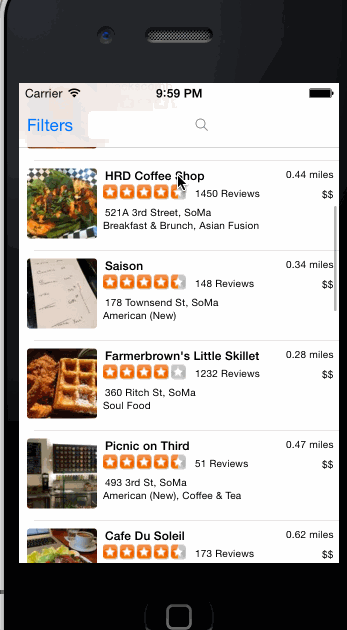

# myYelp
Ashok's myYelp implementation - iOS class

This is an iOS demo application for showing business listing as well filters page.

Time spent: 10 hours spent in total

Completed user stories:

 * [x] Required: Table rows should be dynamic height according to the content height
 * [x] Required: Custom cells should have the proper Auto Layout constraints
 * [x] Search bar should be in the navigation bar (doesn't have to expand to show location like the real Yelp app does).
 * [x] The filters you should actually have are: category, sort (best match, distance, highest rated), radius (meters), deals (on/off).
 * []The filters table should be organized into sections as in the mock.
 * []You can use the default UISwitch for on/off states.
 * []Clicking on the "Search" button should dismiss the filters page and trigger the search w/ the new filter settings
 
Notes:
I missed Thursday class as spent some time catching up class video to implement filter page using provided videos.

Walkthrough of all user stories:

GIF created with [LiceCap](http://www.cockos.com/licecap/).
